# HandSign-Language-Detection  
## INTRODUCTION  
Communication can be characterized as the act of exchanging data from one individual, or bunch to another. It comprises three components: the speaker, the message that’s being communicated, and the audience. It can be considered effective as it were when any messages the speaker is attempting to pass on are caught and caught by the audience. It can be separated into distinctive categories as taken after formal and casual communication, verbal (face-to-face and remove) and composed communication, non-verbal, grapevine, criticism, visual communication, and dynamic tuning in. Formal communication (official communication) is controlled through the channels that are pre-determined. Informal or grapevine communication is the unconstrained communication between people in one’s calling that does not have any formal convention or structure. Verbal communication (face-to-face and separate) is the communication in which words are traded between individuals who are shown in front or at a remove (with the assistance of innovation counting voice and video calls, webinars, etc.). Composed communication is communication in which letters, emails, notes, or any other composed shape is utilized for communicating. Non-verbal communication is the communication that employments signals, facial expressions, body dialect, etc. Input communication happens when an individual gives input on a few items or benefits given by a person or a company. Visual communication happens when an individual gets data from a visual source like TV, social organizing, or any other source. Dynamic tuning in is when an individual tunes in to and gets what the other person is attempting to pass on so that the communication gets to be more significant and compelling.  
## METHODOLOGY  
I’ve made two models for the same, to distinguish between CNN architecture and LSTM architecture.  
### 1. CNN Architecture  
**1.1.  Import and Install Dependencies:** The libraries used for this project are-
(1)	 MatPlotLib – To plot the images as graphs for interpretation.  
(2)	TensorBoard- To show the graphs on a web-based platform.  
(3)	 ImageDataGenerator- TO preprocess and clean the dataset.  
(4)	Sequential model- To build a sequential CNN model. 

**1.2.  Data- Collection and Data-Loading:**  We have the dataset in 36 different classes, namely 0-9 and A-Z.  

**1.3.  Data Augmentation:** To increase the diversity of the dataset and thus improving the performance of the model, we have incorporated the following augmentation methods:  
(1)	rotation_range=15  
(2)	width_shift_range=0.2 height_shift_range=0.2    
(3)	shear_range=0.2  
(4)	zoom_range=0.2  
(5)	horizontal_flip=True  
(6)	fill_mode=’nearest’  

**1.4.  Model Building:** We have the following neural layers:  
(1)	 Conv2D layer: The first layer has 32 neurons with kernel size of 3*3 matrix, activation function- RELU and the input shape is 224*224 image of RGB values.  
(2)	Max Pool layer- 2*2 matrix  
(3)	Conv2D layer: The second Conv layer has 48 neurons with kernel size of 3*3 matrix, activation function- RELU.  
(4)	Max Pool layer- 2*2 matrix  
(5)	Conv2D layer: The third Conv layer has 64 neurons with kernel size of 3*3 matrix, activation function- RELU.   
(6)	Max Pool layer- 2*2 matrix  
(7)	Now, we flatten the model.  
(8)	Dense Layer: 64 neurons with activation function- ‘RELU’  
(9)	Dense Layer:  36 neurons (number of final classes) with activation function- ‘Softmax’.  

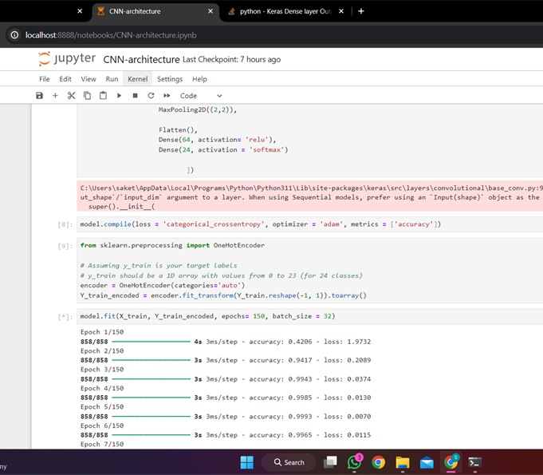  
Fig 1: CNN Model Building  

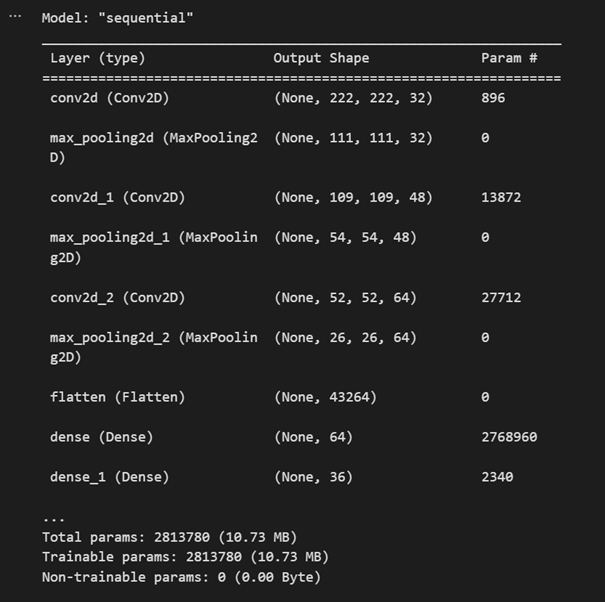  
Fig 2: CNN Model Summary  

**1.5.  Evaluation:**  
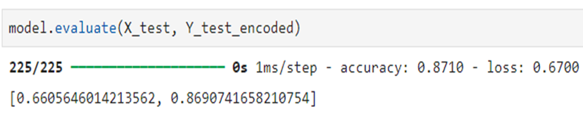  
Fig 3: CNN model evaluation  

### 2. LSTM Architecture  
**2.1.	Import and Install Dependencies:** The libraries used for this project are-  
(1)	MediaPipe- to make keypoints for our Action Detection model.  
(2)OpenCV- To access camera from the device to capture photographs.  
(3)	NumPy- To perform various array operations, like flattening an array, increasing dimensions of the array, etc.  
(4)	MatPlotLib- To plot the images as graphs for interpretation.  
(5)	Time- To give interval breaks between consecutive images.  
(6)	 TensorBoard- To show the graphs on a web-based platform.  

**2.2.	Keypoints using MeidaPipe holistic:** Holistic key points are obtained from the overall body postures through the camera with the help of MediaPipe. Specifically, MediaPipe library comes equipped with pre-trained models to enable accurate detection of human hand, face and posture landmarks. We even style the landmarks for easier distinguishing.  
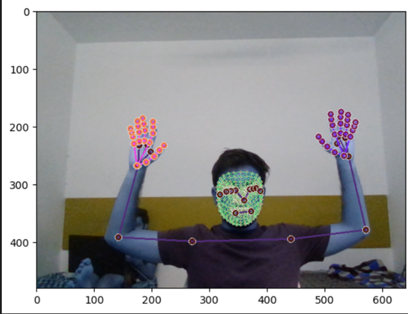  
Fig 4: Landmarks Collection  

**2.3.	Extract Keypoint Values:** The MediaPipe library provides pre-trained models for detecting human hand and body keypoints accurately. Once we have keypoints for both the hands, face, and posture, we are going to extract the required keypoints for the action detection for further processing.  

**2.4.	Setup Folders for Collection:** Folders are made to collect and store the extracted keypoints from the above steps for training and testing datasets. This step ensures labelling and proper management of data.  

**2.5.	Collect Keypoint Values for Training and Testing:** Now, we capture images from the camera for various classes and store them in their respective classes’ folders, images from both the hands are captured to make sure that there is diversity in the dataset and thus increases the accuracy.  

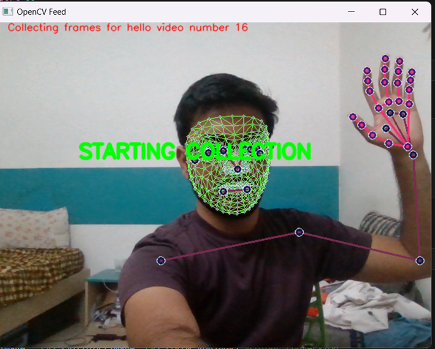  
Fig 5: LSTM Data Collection  

**2.6.	Preprocess Data and Create Labels and Features:** The collected keypoints data is pre-processed using NumPy matrix operators (increasing and decreasing the size and dimensions of the array) Feature engineering is also be performed to extract relevant features from the keypoint data. This is the step in which we use Scikit-learn and perform categorical test-train split of 95% and 5% respectively.  

**2.7.	Build and Train LSTM Neural Network:** We build a sequential model made up of 3 LSTM layers and 3 Dense layers, using the ‘relu’ activation function and ‘softmax’ as the final activation function. ‘Adam’ optimizer is used for the same along with ‘categorical crossentropy’ and further the model is trained for 150 epochs.  

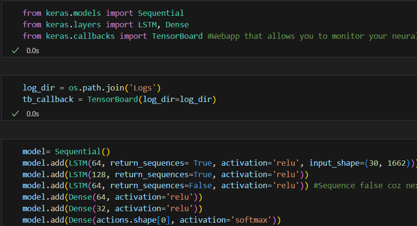  
Fig 6: LSTM Model Building  

**2.8.	Make Predictions:** The test data is predicted based on the learning from above.  

**2.9.	Save Weights:** Weights are saved to ensure that the model can be reused in future.  

**Evaluation using Confusion Matrix, F1 Score and Accuracy:**  
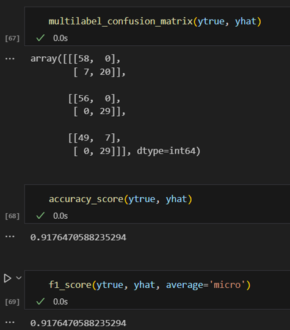  
Fig 7: LSTM Evaluation  

S
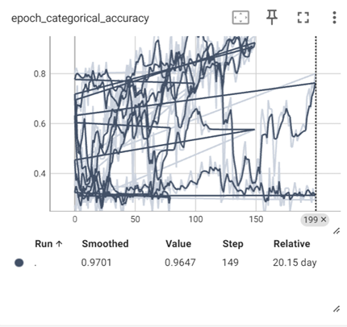  
Fig 8: LSTM Epoch Categorical Accuracy  

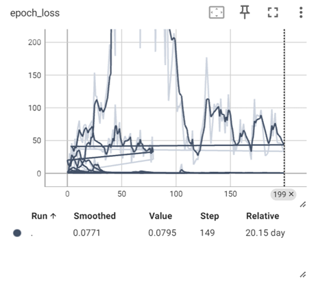  
Fig 9: LSTM Epoch Loss  

**2.11.	 Test in Real Time:**  
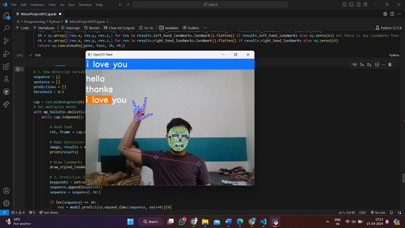  
Fig 10: LSTM Testing in Real Time-1  
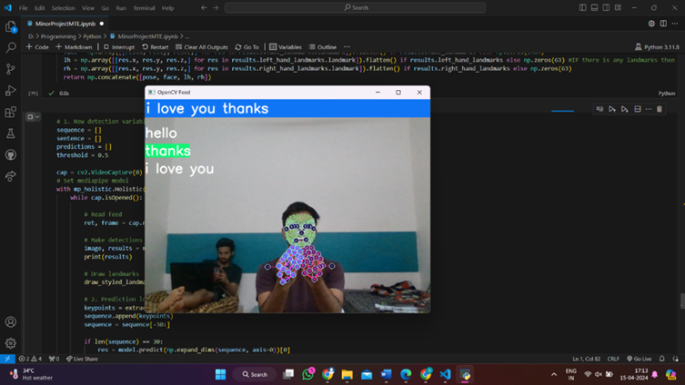  
Fig 11: LSTM Testing in Real Time-2  

## CONCLUSION
The proposed methodology provides a systematic approach for developing a hand sign language detection system using LSTM networks. By leveraging MediaPipe for keypoints extraction and LSTM for sequential data analysis, the system demonstrates potential in facilitating communication for individuals with speech or hearing impairments. Further research and refinement of the methodology could enhance the accuracy and robustness of the hand sign language detection system.
